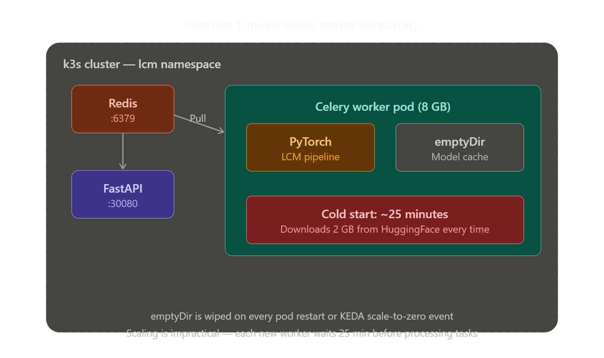
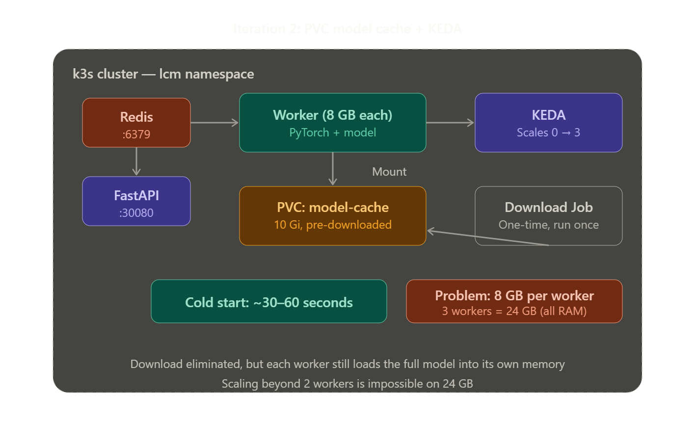
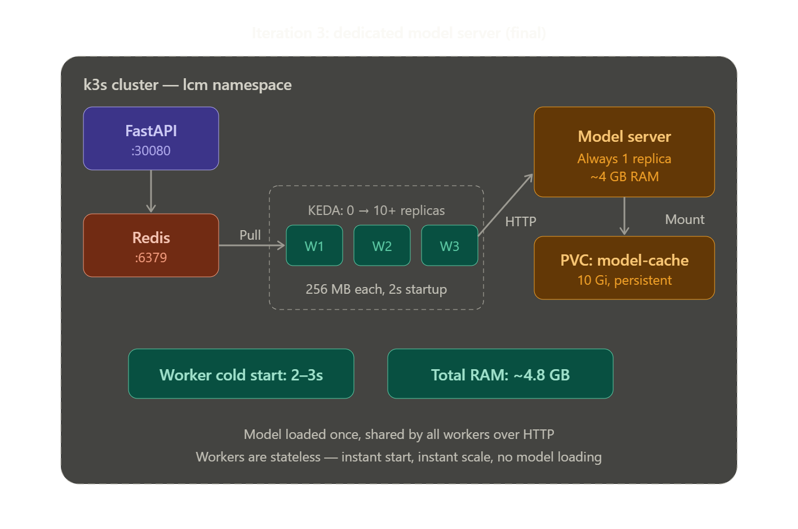

## Kubernetes Deployment with KEDA Autoscaling

This section documents the deployment of the LCM inference server on a single-node k3s cluster with KEDA event-driven autoscaling. The architecture went through three iterations, each solving a problem discovered in the previous one. Understanding the progression is as valuable as the final result.

---

### Why Kubernetes for a Single Laptop?

Running Kubernetes on a laptop with `docker compose up` already working seems like unnecessary complexity. It's not — the learning value is substantial. Docker Compose gives you multi-container orchestration, but it doesn't give you declarative desired-state management, automated health-based restarts, rolling deployments, resource limits enforced by the kernel (via cgroups), persistent volume lifecycle management, or event-driven autoscaling. These are the concepts that matter in production ML serving, and k3s lets you learn all of them on local hardware before touching cloud infrastructure.

k3s was chosen over full Kubernetes, minikube, or kind because it installs as a single binary, runs as a systemd service, bundles containerd, CoreDNS, Traefik, local-path-provisioner, and metrics-server out of the box, and uses ~500 MB of RAM for the control plane. On a 24 GB laptop, that overhead is negligible.

---

### Architecture Evolution

The deployment went through three iterations. Each solved a real problem encountered during testing.

#### Iteration 1: Model Inside the Worker (emptyDir)

The first attempt was a direct translation of the Docker Compose setup into Kubernetes manifests. Each Celery worker pod contained PyTorch, diffusers, and the full LCM pipeline. The HuggingFace model cache was stored in an `emptyDir` volume — a temporary directory that exists only as long as the pod lives.


This worked functionally but had a critical flaw: the `emptyDir` volume is destroyed whenever the pod dies. A KEDA scale-to-zero event, a node restart, or an OOM kill all trigger a fresh 2 GB download from HuggingFace on the next startup. During testing, this resulted in 25+ minute cold starts — completely unusable for an autoscaling setup where workers are expected to start and stop frequently.

The other problem was memory: each worker loaded the entire LCM pipeline (~4 GB at float32) into its own process memory. With the 8 GB per-worker limit, the maximum was 2-3 workers before exhausting the laptop's 24 GB of RAM.

#### Iteration 2: PVC Model Cache + KEDA


The fix for the download problem was to separate model storage from the worker pod lifecycle. A PersistentVolumeClaim (PVC) backed by k3s's `local-path-provisioner` provides storage that survives pod restarts, scale-to-zero events, and even cluster reboots.

A one-time Kubernetes Job downloads both models (Dreamshaper 8 LCM and the Tiny VAE) from HuggingFace into the PVC. This Job runs once, takes ~15-25 minutes, and never needs to run again unless you switch models. All worker pods then mount this PVC as a read-only volume, and the `HF_HOME` environment variable points the HuggingFace library at it.


This reduced cold start from 25 minutes to ~30-60 seconds — loading from local NVMe is orders of magnitude faster than downloading over the network. KEDA autoscaling became practical: a scale-from-zero event now had an acceptable startup penalty.

However, the memory problem remained. Each worker still loaded the full model into its own RAM. Two workers meant 16 GB used just for duplicate copies of the same weights. This severely limited the scaling ceiling on constrained hardware.

#### Iteration 3: Dedicated Model Server (Final Architecture)


The solution was to separate the model from the worker entirely. Instead of every worker loading its own copy of the model, a single dedicated model server pod loads the pipeline once and exposes inference over an internal HTTP endpoint. Workers become thin, stateless clients — they pull tasks from Redis, send the prompt to the model server, save the returned image, and report back. No PyTorch, no diffusers, no model in worker memory.

```
┌──────────────────────────────────────────────────────────┐
│ k3s cluster — lcm namespace                               │
│                                                            │
│  FastAPI ──► Redis ──► Thin workers ──► Model server       │
│  :30080       :6379    (256 MB each)    :8001              │
│  (512 MB)              KEDA 0→10+       (4 GB, always on)  │
│                                         PVC: model-cache   │
│                                                            │
│  Shared volume: generated-images (PVC)                     │
│  Workers save images → API serves them                     │
└──────────────────────────────────────────────────────────┘
```

The impact was dramatic:

| Metric | Iteration 1 | Iteration 2 | Iteration 3 |
|---|---|---|---|
| Worker cold start | ~25 minutes | ~30-60 seconds | 2-3 seconds |
| Memory per worker | 8 GB | 8 GB | 256 MB |
| Model copies in RAM | 1 per worker | 1 per worker | 1 total |
| Max workers (24 GB) | 2-3 | 2-3 | 10+ |
| KEDA scale-to-zero penalty | Unusable | Acceptable | Negligible |
| Worker Docker image size | ~4 GB | ~4 GB | ~80 MB |
| Worker dependencies | PyTorch, diffusers, CUDA stubs | PyTorch, diffusers, CUDA stubs | requests, celery |

The model server stays at 1 replica permanently — it's the "warm brain" that holds the pipeline at a fixed ~4 GB cost. KEDA only scales the thin workers, which start in seconds and consume almost no resources. This is the same pattern used by production ML serving systems like Triton Inference Server, TorchServe, and vLLM: separate the model runtime from the task orchestration.

---

### Project Structure (Kubernetes Files)

```
lcm-inference-server/
├── k8s/
│   ├── namespace.yaml           # lcm namespace
│   ├── configmap.yaml           # Shared env vars for all pods
│   ├── redis.yaml               # Deployment + Service
│   ├── pvc.yaml                 # PVC for generated images
│   ├── pvc-model-cache.yaml     # PVC for cached model weights
│   ├── model-download-job.yaml  # One-time Job to download model
│   ├── model-server.yaml        # Deployment + Service
│   ├── api.yaml                 # Deployment + Service (NodePort)
│   ├── worker.yaml              # Deployment (no replicas — KEDA-managed)
│   └── keda-scaledobject.yaml   # KEDA scaling configuration
│
├── model-server/
│   ├── server.py                # FastAPI app exposing /infer endpoint
│   └── requirements.txt         # PyTorch + diffusers + FastAPI
│
├── Dockerfile.model-server      # Heavy image (~4 GB with PyTorch)
├── Dockerfile.worker            # Slim image (~80 MB, just requests + celery)
├── Dockerfile.api               # Slim image (~150 MB, FastAPI only)
│
└── (api/, worker/, shared/ — same as Docker Compose setup)
```

---

### Prerequisites

Before starting, you need:

- **Docker** installed (for building images)
- **~12 GB free disk space** for Docker images and model weights
- The existing `lcm-inference-server` project from the Docker Compose setup
- Your Docker Compose stack stopped (`docker compose down`)

---

### Step-by-Step Setup

#### 1. Install k3s

```bash
curl -sfL https://get.k3s.io | sh -
```

Wait 30 seconds, then verify:

```bash
sudo k3s kubectl get nodes
```

Set up kubectl for your user (no sudo):

```bash
mkdir -p ~/.kube
sudo cp /etc/rancher/k3s/k3s.yaml ~/.kube/config
sudo chown $(id -u):$(id -g) ~/.kube/config
chmod 600 ~/.kube/config
kubectl get nodes
```

#### 2. Install Helm (needed for KEDA)

```bash
curl -fsSL -o get_helm.sh https://raw.githubusercontent.com/helm/helm/main/scripts/get-helm-3
sudo bash get_helm.sh
rm get_helm.sh
helm version
```

#### 3. Install KEDA

```bash
helm repo add kedacore https://kedacore.github.io/charts
helm repo update
helm install keda kedacore/keda --namespace keda --create-namespace
```

Wait for KEDA pods:

```bash
kubectl get pods -n keda -w
# Wait until all 3 pods (operator, metrics-apiserver, admission-webhooks) show Running
```

#### 4. Build and Import Docker Images into k3s

k3s uses containerd, not Docker. Images must be exported from Docker and imported into k3s's containerd:

```bash
cd ~/lcm-inference-server

# Build all three images
docker build -t lcm-api:local -f Dockerfile.api .
docker build -t lcm-worker:local -f Dockerfile.worker .
docker build -t lcm-model-server:local -f Dockerfile.model-server .

# Export as tarballs
docker save lcm-api:local -o /tmp/lcm-api.tar
docker save lcm-worker:local -o /tmp/lcm-worker.tar
docker save lcm-model-server:local -o /tmp/lcm-model-server.tar

# Import into k3s containerd
sudo k3s ctr images import /tmp/lcm-api.tar
sudo k3s ctr images import /tmp/lcm-worker.tar
sudo k3s ctr images import /tmp/lcm-model-server.tar

# Verify
sudo k3s ctr images list | grep lcm
```

All Kubernetes manifests use `imagePullPolicy: Never` so k3s uses these local images instead of trying to pull from a registry.

#### 5. Apply Kubernetes Manifests (In Order)

The order matters — each resource depends on the ones before it:

```bash
cd ~/lcm-inference-server/k8s

# Namespace
kubectl apply -f namespace.yaml

# Configuration
kubectl apply -f configmap.yaml

# Storage
kubectl apply -f pvc.yaml
kubectl apply -f pvc-model-cache.yaml

# Redis (other services depend on it)
kubectl apply -f redis.yaml
kubectl -n lcm wait --for=condition=Ready pod -l app=redis --timeout=60s

# Download the model (one-time, takes 15-25 minutes)
kubectl apply -f model-download-job.yaml
kubectl -n lcm logs -f job/download-lcm-model
# Wait until you see "MODEL DOWNLOAD COMPLETE"

# Model server (needs the PVC to be populated)
kubectl apply -f model-server.yaml
kubectl -n lcm logs -f deployment/model-server
# Wait until you see "Model loaded in XXs"

# API gateway
kubectl apply -f api.yaml
kubectl -n lcm wait --for=condition=Ready pod -l app=lcm-api --timeout=60s

# Worker deployment (no pods yet — KEDA manages replicas)
kubectl apply -f worker.yaml

# KEDA ScaledObject (starts managing worker replicas)
kubectl apply -f keda-scaledobject.yaml
```

#### 6. Verify the Stack

```bash
# All resources
kubectl -n lcm get all

# Expected:
# pod/redis-xxxxx              1/1   Running
# pod/model-server-xxxxx       1/1   Running
# pod/lcm-api-xxxxx            1/1   Running
# (no worker pods — KEDA scaled to 0, queue is empty)

# Check KEDA
kubectl -n lcm get scaledobject
# READY: True, ACTIVE: False

# Health checks
curl http://localhost:30080/health
kubectl -n lcm exec deployment/lcm-api -- \
  python -c "import urllib.request; print(urllib.request.urlopen('http://model-server:8001/health').read().decode())"
```

#### 7. Generate an Image

```bash
# Submit a task
curl -X POST http://localhost:30080/generate \
  -H "Content-Type: application/json" \
  -d '{"prompt": "a cat astronaut on the moon, oil painting style, 8k", "seed": 42}'

# Watch KEDA spin up a worker (in another terminal)
kubectl -n lcm get pods -w

# Poll for completion (replace with your task_id)
curl http://localhost:30080/status/<task_id>

# Download the image
curl -o generated.png http://localhost:30080/result/<task_id>
```

#### 8. Test Autoscaling

Submit a burst of tasks and watch KEDA scale workers:

```bash
# Terminal 1: Watch pods
kubectl -n lcm get pods -l app=lcm-worker -w

# Terminal 2: Submit 5 tasks
for i in $(seq 1 5); do
  curl -s -X POST http://localhost:30080/generate \
    -H "Content-Type: application/json" \
    -d "{\"prompt\": \"test image $i, digital art\"}" &
done
wait
echo "5 tasks submitted"
```

You should see workers appear in 2-3 seconds, process tasks, and then scale back to 0 after the 2-minute cooldown period.

---

### KEDA Configuration Explained

The ScaledObject in `keda-scaledobject.yaml` is the core of the autoscaling setup. KEDA's Redis scaler runs `LLEN inference` every 15 seconds to check how many tasks are in the Celery queue, then calculates the desired number of worker replicas.

Key parameters and why they're set the way they are:

`minReplicaCount: 0` enables scale-to-zero. When the queue is empty for longer than the cooldown period, KEDA terminates all worker pods. No workers running means no memory consumed and no CPU used. This is the primary cost optimization — on a cloud provider, this translates directly to reduced compute bills.

`maxReplicaCount: 3` caps the worker count. Each thin worker uses only 256 MB, so RAM isn't the constraint anymore — CPU is. The model server processes inference sequentially, so adding workers beyond the model server's throughput only adds queue consumers, not inference parallelism. On this single-core model server, 3 workers is a reasonable buffer for task queueing and I/O overlap.

`cooldownPeriod: 120` waits 2 minutes after the queue drains before scaling to 0. This prevents rapid on/off cycling when tasks arrive in bursts with gaps. Without it, a pause of 15 seconds between task batches would trigger a full scale-down and scale-up cycle.

`listLength: "1"` sets the target tasks-per-replica ratio. KEDA calculates desired replicas as `ceil(queue_length / listLength)`. With "1", each pending task triggers one worker replica (up to max). This is aggressive — appropriate for long-running inference tasks where you want every task to have a dedicated consumer.

The `horizontalPodAutoscalerConfig.behavior` section controls the rate of scaling. Scale-up is immediate (`stabilizationWindowSeconds: 0`) with a cap of 1 pod per 30 seconds — conservative because you don't want 3 workers launching simultaneously on limited hardware. Scale-down removes 1 pod per 60 seconds with a 60-second stabilization window, preventing premature scale-down during bursty workloads.

---

### Key Design Decisions

#### Why the Model Server Pattern?

The naive approach — loading the model in every worker — is the default in most Celery tutorials. It works fine when your workers are stateless and your model is small. It breaks when:

- The model is large relative to available RAM (our case: 4 GB model, 24 GB total)
- Workers scale up and down frequently (KEDA)
- Model loading time is significant (30+ seconds)
- You want scale-to-zero without paying a reload penalty

The model server pattern solves all four. The tradeoff is an additional network hop (worker → model server → worker) and serialization overhead (base64-encoding the output image). For our use case — 512×512 PNGs taking 30+ seconds to generate — the ~100ms network overhead is negligible.

#### Why PVC Instead of Baking the Model into the Docker Image?

The `Dockerfile.worker` in the Docker Compose setup baked the model into the image with a `RUN python -c "..."` step. This works but creates a ~4 GB Docker image that's slow to build, slow to push, and slow to import into containerd. More importantly, changing the model requires rebuilding the entire image.

The PVC approach separates concerns: the Docker image contains only code and dependencies (~80 MB for the worker, ~4 GB for the model server), while the model weights live on persistent storage. Switching models means running a new download Job and restarting the model server — no Docker rebuild needed.

#### Why ReadOnly Mounts?

The model-cache PVC is mounted as `readOnly: true` in the model server. This has two benefits: multiple pods can mount the same `ReadWriteOnce` PVC simultaneously (Kubernetes allows multiple read-only mounts), and it prevents accidental model corruption from a buggy process. The download Job is the only thing that writes to this volume.

#### Why the API Has a Redis Retry Loop

In Docker Compose, `depends_on: condition: service_healthy` ensures Redis starts before the API. Kubernetes has no equivalent — pods start in parallel. The API's `lifespan` function retries the Redis connection 30 times (once per second) to handle the race condition where the API pod starts before Redis is ready. Without this, the API crashes on startup with a `ConnectionRefusedError`.

---

### Monitoring and Debugging

```bash
# Full picture: all resources in the lcm namespace
kubectl -n lcm get scaledobject,hpa,deployment,pods,pvc,svc

# Watch scaling in real time
kubectl -n lcm get pods -l app=lcm-worker -w

# Check Redis queue depth manually
kubectl -n lcm exec deployment/redis -- redis-cli LLEN inference

# KEDA operator logs (scaling decisions)
kubectl -n keda logs deployment/keda-operator --tail=50 | grep lcm

# Describe ScaledObject (events + status)
kubectl -n lcm describe scaledobject lcm-worker-scaler

# Model server logs
kubectl -n lcm logs -f deployment/model-server

# Worker logs (when workers are running)
kubectl -n lcm logs -f deployment/lcm-worker

# API logs
kubectl -n lcm logs -f deployment/lcm-api

# Check HPA metrics
kubectl -n lcm get hpa
```

### Rebuilding After Code Changes

Whenever you modify Python code, rebuild the affected image, re-export, and re-import:

```bash
# Example: rebuilding the worker after a code change
cd ~/lcm-inference-server
docker build -t lcm-worker:local -f Dockerfile.worker .
docker save lcm-worker:local -o /tmp/lcm-worker.tar
sudo k3s ctr images import /tmp/lcm-worker.tar
kubectl -n lcm rollout restart deployment/lcm-worker
```

### Tearing Down

```bash
# Remove application resources
kubectl delete namespace lcm

# Remove KEDA
helm uninstall keda -n keda
kubectl delete namespace keda

# Uninstall k3s entirely
/usr/local/bin/k3s-uninstall.sh
```

---

### What This Setup Includes

This Kubernetes deployment covers a dense set of infrastructure concepts:

- **Container orchestration**: Deployments, Services, ConfigMaps, PVCs, Jobs, namespaces
- **Service discovery**: Kubernetes DNS (`redis.lcm.svc.cluster.local`)
- **Health management**: Readiness probes, liveness probes, restart policies
- **Resource governance**: CPU/memory requests and limits, memory caps
- **Persistent storage**: PVCs, StorageClasses, `local-path-provisioner`, volume mount modes
- **Event-driven autoscaling**: KEDA ScaledObjects, Redis scalers, HPA behavior policies, scale-to-zero
- **ML serving patterns**: Model server separation, inference-as-a-service, warm vs cold model loading
- **Image management**: Docker-to-containerd import pipeline, `imagePullPolicy: Never`
- **Iterative architecture**: Evolving a design through three iterations based on real performance data