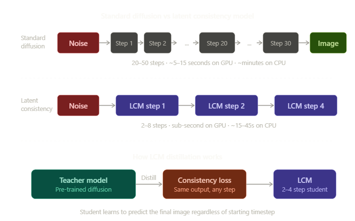
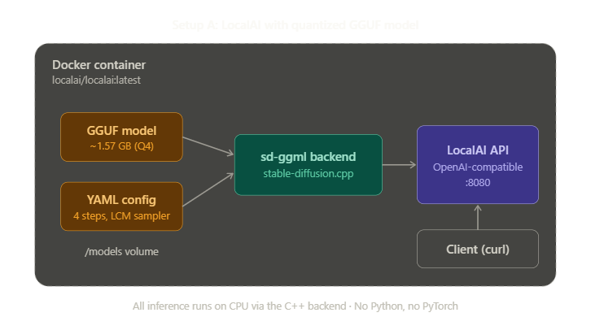
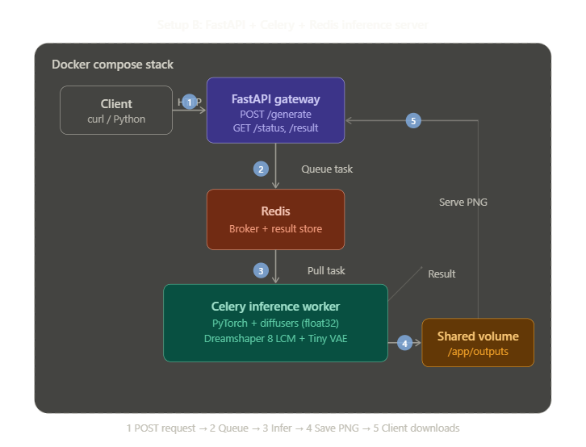

# Serving Latent Consistency Models: From Theory to Local Inference

A hands-on project for learning model quantization and inference serving by running a Latent Consistency Model (LCM) on consumer hardware — no GPU required.

This project implements two complete serving approaches:
- **Setup A** — LocalAI with a pre-quantized GGUF model (fastest path to a running server)
- **Setup B** — A custom FastAPI + Celery + Redis inference pipeline (deeper learning, more control)

Both setups run on a laptop with 24 GB RAM, an 8th-gen Intel Core i5, and no dedicated GPU.

---

## Table of Contents

1. [What Are Latent Consistency Models?](#what-are-latent-consistency-models)
2. [How Latent Consistency Models Work](#how-latent-consistency-models-work)
3. [Tradeoffs of Using LCMs](#tradeoffs-of-using-lcms)
4. [Model Selection and Hardware Constraints](#model-selection-and-hardware-constraints)
5. [Setup A: LocalAI with Quantized GGUF Model](#setup-a-localai-with-quantized-gguf-model)
6. [Setup B: FastAPI Inference Server](#setup-b-fastapi-inference-server)
7. [Extending the Project](#extending-the-project)

---

## What Are Latent Consistency Models?

Diffusion models like Stable Diffusion generate images by starting with pure random noise and gradually removing it over many steps — typically 20 to 50 — until a coherent image emerges. Each step asks the model to predict and remove a small amount of noise, then feeds the slightly cleaner result back into the model. This iterative process produces impressive images but is inherently slow: every step requires a full forward pass through a neural network with hundreds of millions of parameters.

Latent Consistency Models (LCMs) are a class of generative models designed to shortcut this process. Rather than removing noise incrementally over dozens of steps, an LCM learns to predict the final clean image directly from any point along the noise-to-image trajectory. This means an LCM can generate a usable image in just 2 to 8 steps — a 5x to 25x reduction in compute compared to the teacher model it was derived from.

The "latent" in the name refers to where the computation happens. Like Stable Diffusion, LCMs operate in a compressed latent space (typically 64×64 for a 512×512 image) rather than on raw pixels. This compressed representation is produced by a Variational Autoencoder (VAE) and keeps the computational cost manageable even on modest hardware.

LCMs were introduced in the paper "Latent Consistency Models: Synthesizing High-Resolution Images with Few-Step Inference" (Luo et al., 2023). The key insight was applying consistency distillation — previously limited to pixel-space models at low resolutions — to the latent space of pre-trained diffusion models like Stable Diffusion. This made few-step generation practical for high-resolution images (512×512 and above) for the first time.

---

## How Latent Consistency Models Work



LCMs are created through a process called **Latent Consistency Distillation**. The core idea is to train a student model (the LCM) to replicate the output of a teacher model (a pre-trained diffusion model like Stable Diffusion) but in far fewer steps.

### The Consistency Property

The fundamental principle behind consistency models is the **self-consistency property**: if you start from any point along the noise-to-image trajectory and ask the model "what does the final clean image look like?", you should always get the same answer, regardless of which starting point you picked.

In mathematical terms, consider the path from pure noise at time T to a clean image at time 0. A standard diffusion model traces this path step by step. A consistency model learns a function f(z_t, t) that maps any noisy sample z_t at any timestep t directly to the predicted clean output z_0. The consistency requirement says that f(z_t1, t1) ≈ f(z_t2, t2) for any two timesteps t1 and t2 on the same trajectory.

### The Distillation Process

LCM distillation works in three stages:

**Stage 1: Start with a trained teacher.** The teacher is any pre-trained latent diffusion model — for example, Stable Diffusion v1.5 or SDXL. This model already knows how to generate high-quality images but requires many steps.

**Stage 2: Apply consistency distillation loss.** The student LCM is trained to satisfy the consistency property. For each training step, the process computes what the teacher model would predict as z_0 from two different timesteps (say t=1000 and t=980) on the same trajectory, then trains the student to produce the same output from both starting points. This uses a technique called "skipping steps" where the gap between timesteps (k=20 in the original paper) is large enough to create meaningful training signal while staying close enough for accuracy.

**Stage 3: One-stage guided distillation.** Unlike earlier two-stage approaches that first distilled out classifier-free guidance and then distilled the model itself, LCMs combine both into a single stage. The guidance scale is treated as an additional input to the model using an embedding, so the student learns guidance-aware generation in one pass. This cuts training time dramatically — a high-quality 768×768 LCM requires only about 32 A100 GPU hours to distill (roughly 4,000 training steps).

### At Inference Time

Once distilled, the LCM operates as a direct predictor. Given random noise z_T and a text prompt, it predicts z_0 in a single forward pass. In practice, 2-4 passes (steps) produce better results because each step refines the prediction. The LCM scheduler handles the timestep selection, and because guidance is baked into the model weights, the classifier-free guidance scale is set to 1.0 (or very close to it) — unlike standard diffusion which typically uses 7-12.

---

## Tradeoffs of Using LCMs

LCMs trade image quality for inference speed. Understanding these tradeoffs is essential for choosing whether an LCM fits your use case.

### Advantages

**Speed.** The most obvious benefit. 4 LCM steps instead of 30 diffusion steps means 7-8x fewer forward passes through the UNet. On a GPU, this translates to sub-second generation. On CPU, it means the difference between 30 seconds (LCM at 4 steps) and several minutes (standard SD at 30 steps).

**Lower compute requirements.** Fewer steps means less total FLOPS per image. This makes LCMs practical for real-time applications, video frame generation, interactive tools, and deployment on edge devices or CPU-only machines like the laptop in this project.

**Same architecture.** LCMs share the same model architecture as their teacher (UNet + VAE + text encoder). This means they're compatible with the entire ecosystem of tools built for Stable Diffusion — schedulers, LoRA adapters, ControlNet, img2img, inpainting — with minimal modifications.

**Efficient distillation.** Creating an LCM from a pre-trained model requires only ~32 A100 GPU hours. This is cheap compared to training a model from scratch and means the community can rapidly produce LCM variants of popular fine-tuned models.

### Disadvantages

**Reduced image quality.** This is the primary tradeoff. LCM images at 4 steps are noticeably softer and less detailed than the same model run for 30 steps. Fine details like hair strands, fabric texture, and background elements suffer most. The distillation process approximates the teacher's output, and that approximation inherently loses information.

**Weaker text-image alignment.** Complex prompts with specific compositional requirements (e.g., "a red ball on top of a blue cube to the left of a green pyramid") degrade more in LCMs than simple prompts. The few-step regime gives the model less opportunity to iteratively refine the spatial arrangement of objects.

**Narrower sweet spot for parameters.** Standard diffusion models are forgiving across a wide range of guidance scales (5-15) and step counts (15-50). LCMs are much more brittle: guidance_scale must stay near 1.0, and the step count has a narrow useful range (2-8). Going to 1 step produces noticeable artifacts; going above 8 offers diminishing returns while approaching standard diffusion speed.

**Not suitable for all applications.** For production use cases requiring maximum image quality — commercial illustration, medical imaging, print-resolution photography — the quality gap is too large. LCMs are best suited for previews, interactive tools, prototyping, video generation, and learning projects like this one.

---

## Model Selection and Hardware Constraints

### The Hardware

This project targets a consumer laptop with significant constraints:

| Component | Spec | Implication |
|---|---|---|
| RAM | 24 GB | Can hold a full SD 1.5 pipeline (~4 GB) with headroom, but SDXL (~10-12 GB) is risky |
| CPU | 8th-gen Intel Core i5 | 4 cores / 8 threads, AVX2 support but no AVX-512, no native FP16 compute |
| GPU | None | All inference runs on CPU — every optimization matters |

### Why Dreamshaper 8 LCM

The model used in both setups is **Lykon/dreamshaper-8-lcm**, a Stable Diffusion 1.5-based model. Here's why it was chosen over alternatives:

**SD 1.5 base (not SDXL).** The SD 1.5 UNet has ~860M parameters vs SDXL's ~2.6B. At float32 on CPU, that's ~3.4 GB vs ~10.4 GB just for the UNet. On a 24 GB machine with no GPU, SD 1.5 is the only architecture that leaves comfortable headroom for the OS, Docker, Redis, and the API process.

**Dreamshaper specifically.** Created by Lykon, Dreamshaper is a versatile general-purpose fine-tune of SD 1.5 that handles diverse styles — photorealism, illustration, anime, fantasy — better than the base SD 1.5 model. It's one of the most popular community fine-tunes with extensive testing and documentation. The LCM variant was distilled specifically for fast inference while preserving this versatility.

**Mature ecosystem.** Dreamshaper 8 LCM is available in multiple formats: HuggingFace diffusers format (for Setup B), GGUF quantized format (for Setup A via LocalAI), ONNX (for OpenVINO), and safetensors. This makes it ideal for a learning project about quantization and serving because you can compare the same model across formats.

### CPU-Specific Optimizations

Two key adjustments were made for CPU inference:

**float32 instead of float16.** This is counterintuitive — float16 uses half the memory and is faster on GPUs. But 8th-gen Intel i5 CPUs don't have native FP16 ALUs. When PyTorch runs float16 on this CPU, it silently promotes every operation to float32, performs the computation, then truncates back to float16. This is strictly slower than just using float32. The memory savings are real (~1.7 GB less) but the speed penalty isn't worth it on this hardware.

**Tiny AutoEncoder (TAESD).** The standard SD 1.5 VAE decoder has ~49M parameters and takes several seconds on CPU. TAESD (by madebyollin) is a ~2M parameter distilled VAE that decodes latents approximately 10x faster with minimal quality loss. It saves ~1 GB of RAM and cuts the decode step from seconds to hundreds of milliseconds. For a learning project, this tradeoff is excellent.

---

## Setup A: LocalAI with Quantized GGUF Model

This setup uses LocalAI — an open-source inference server with an OpenAI-compatible API — to serve a pre-quantized GGUF model. Everything runs in a single Docker container. No Python, no PyTorch.

### Architecture



### Step 1 — Create the Project Directory

```bash
mkdir -p ~/localai-lcm/models
cd ~/localai-lcm
```

### Step 2 — Download the Quantized Model

Download the IQ4_NL quantization (4-bit, ~1.57 GB) — the best balance of quality and performance on this hardware:

```bash
# Option A: Using huggingface-cli
pip install huggingface_hub
huggingface-cli download \
  stduhpf/dreamshaper-8LCM-im-GGUF-sdcpp \
  dreamshaper_8LCM-iq4_nl-imv2.gguf \
  --local-dir ~/localai-lcm/models

# Option B: Using curl
curl -L -o ~/localai-lcm/models/dreamshaper_8LCM-iq4_nl-imv2.gguf \
  "https://huggingface.co/stduhpf/dreamshaper-8LCM-im-GGUF-sdcpp/resolve/main/dreamshaper_8LCM-iq4_nl-imv2.gguf"
```

Verify the download:

```bash
ls -lh ~/localai-lcm/models/
# Should show: dreamshaper_8LCM-iq4_nl-imv2.gguf  ~1.57 GB
```

### Step 3 — Create the YAML Configuration

```bash
cat > ~/localai-lcm/models/dreamshaper-lcm.yaml << 'EOF'
name: dreamshaper-lcm
backend: stablediffusion-ggml
parameters:
  model: dreamshaper_8LCM-iq4_nl-imv2.gguf
step: 4
cfg_scale: 1.0
options:
- "sampler:lcm"
EOF
```

Configuration breakdown: `backend: stablediffusion-ggml` uses the C++ stable-diffusion.cpp backend which is CPU-optimized. `step: 4` sets the default to 4 LCM denoising steps. `cfg_scale: 1.0` is critical for LCM models because guidance is baked into the weights. `sampler:lcm` selects the correct noise scheduler.

### Step 4 — Start LocalAI

```bash
cd ~/localai-lcm

docker run -d \
  --name localai-lcm \
  -p 8080:8080 \
  -v $PWD/models:/models \
  localai/localai:latest \
  --models-path /models \
  --threads 4
```

### Step 5 — Install the Backend

The stablediffusion-ggml backend is not bundled in the base image — it needs to be installed separately:

```bash
docker exec -it localai-lcm local-ai backends install stablediffusion-ggml
docker restart localai-lcm
```

Alternatively, start with auto-install via an environment variable:

```bash
docker run -d \
  --name localai-lcm \
  -p 8080:8080 \
  -v $PWD/models:/models \
  -e LOCALAI_BACKENDS_INSTALL="stablediffusion-ggml" \
  localai/localai:latest \
  --models-path /models \
  --threads 4
```

Wait for startup to complete (check with `docker logs -f localai-lcm`), then verify the model is loaded:

```bash
curl http://localhost:8080/v1/models | python3 -m json.tool
```

### Step 6 — Generate an Image

```bash
curl http://localhost:8080/v1/images/generations \
  -H "Content-Type: application/json" \
  -d '{
    "model": "dreamshaper-lcm",
    "prompt": "a beautiful cyborg with golden hair, portrait, oil painting style, 8k",
    "size": "512x512"
  }'
```

The response returns a URL pointing to the generated image. Open it in a browser or download with `curl -o`.

Using a negative prompt (separated by `|`):

```bash
curl http://localhost:8080/v1/images/generations \
  -H "Content-Type: application/json" \
  -d '{
    "model": "dreamshaper-lcm",
    "prompt": "a cozy cabin in a snowy forest, warm lighting|blurry, low quality, deformed",
    "size": "512x512"
  }'
```

### Expected Performance

| Resolution | Approximate time (4 steps, Q4, i5-8th gen) |
|---|---|
| 256×256 | 5–15 seconds |
| 512×512 | 15–45 seconds |
| 768×768 | 45–120 seconds |

### Management Commands

```bash
docker logs -f localai-lcm     # Watch logs
docker stop localai-lcm        # Stop
docker start localai-lcm       # Restart
docker stop localai-lcm && docker rm localai-lcm   # Remove
```

---

## Setup B: FastAPI Inference Server

This setup builds a custom async inference pipeline from scratch using FastAPI, Celery, and Redis. It loads the same Dreamshaper 8 LCM model in HuggingFace diffusers format (not GGUF) and serves it through a task queue architecture.

### Architecture



### Important Note on Model Format

This setup downloads `Lykon/dreamshaper-8-lcm` from HuggingFace in **diffusers format** (a folder of safetensors files). This is the same underlying model as the GGUF file in Setup A, just in a different format:

| Property | Setup A (GGUF) | Setup B (diffusers) |
|---|---|---|
| Format | Single `.gguf` file | Folder of `.safetensors` + configs |
| Size on disk | ~1.57 GB (quantized Q4) | ~2 GB (full precision) |
| Runtime | stable-diffusion.cpp (C++) | PyTorch + diffusers (Python) |
| Precision | 4-bit integer | float32 |
| What it teaches | Quantization tradeoffs | Model serving architecture |

### Project Structure

```
lcm-inference-server/
├── docker-compose.yml          ← Orchestrates all 3 containers
├── Dockerfile.api              ← Slim image for the FastAPI gateway (~150 MB)
├── Dockerfile.worker           ← Heavy image with PyTorch + model (~4 GB)
├── .dockerignore               ← Keeps Docker build context clean
│
├── shared/                     ← Code imported by BOTH api and worker
│   ├── __init__.py
│   ├── config.py               ← All settings from environment variables
│   └── celery_app.py           ← Celery instance (shared to send + execute tasks)
│
├── api/                        ← The HTTP frontend (no ML dependencies)
│   ├── main.py                 ← FastAPI app: /generate, /status, /result, /health
│   └── requirements.txt        ← FastAPI + Celery client + Redis only
│
├── worker/                     ← The ML backend (heavy dependencies)
│   ├── __init__.py
│   ├── tasks.py                ← Model loading at startup + generation task
│   └── requirements.txt        ← PyTorch CPU + diffusers + Celery
│
└── README.md
```

Each directory and file serves a specific purpose:

**`shared/config.py`** is the single source of truth for all settings. Every value — Redis host, model ID, torch dtype, thread count, output directory — is read from environment variables with sensible defaults. Both the API and worker import from here, so configuration changes happen in one place (the `docker-compose.yml` environment section).

**`shared/celery_app.py`** creates the Celery application instance. This is the critical shared object: the API imports it to *send* tasks (`celery_app.send_task(...)`), and the worker imports it to *discover and execute* tasks. It also configures task routing so generation tasks are routed specifically to the `inference` queue, worker concurrency is set to 1 (because inference is CPU-bound), and prefetch is disabled (so a worker doesn't grab a second task while one is running).

**`api/main.py`** defines all HTTP endpoints. `POST /generate` validates the request body (prompt length, dimension divisibility by 8, step count range), pushes a task to Redis via Celery, and returns a task ID immediately — the client never waits for inference. `GET /status/{task_id}` polls Celery's result backend to check task state. `GET /result/{task_id}` serves the generated PNG from the shared volume. `GET /health` verifies API + Redis connectivity. `GET /queue/stats` returns the current queue depth and active workers — this endpoint is designed to be scraped by KEDA for autoscaling later.

**`worker/tasks.py`** contains the core inference logic. The model is loaded exactly once when the Celery worker process starts, via the `@worker_process_init.connect` signal handler. This avoids the ~30 second model load on every request. The loaded pipeline is stored in a module-level global variable that the `generate_image` task function references. The task itself runs `pipeline(prompt=..., num_inference_steps=4, ...)`, saves the output image to the shared volume, and returns metadata (filename, inference time, parameters used) as the Celery result.

**`Dockerfile.api`** builds a slim ~150 MB image. It only installs FastAPI, uvicorn, and the Celery client library. No PyTorch, no ML dependencies. This is deliberate — the API's job is to accept HTTP, validate input, and talk to Redis. Keeping it lightweight means it starts instantly and uses minimal RAM.

**`Dockerfile.worker`** builds a ~4 GB image. It installs PyTorch CPU (`torch+cpu`, ~700 MB), diffusers, transformers, and then pre-downloads the model at build time with a `RUN python -c "..."` step. Pre-downloading at build time means the model is baked into the Docker image layer, so `docker compose up` starts the worker in seconds rather than waiting 5-10 minutes for a download. The tradeoff is a larger image.

**`docker-compose.yml`** ties it all together. Three services: `redis` (Alpine, with a health check the API waits on), `api` (port 8000, depends on Redis, mounts the shared volume), and `worker` (depends on Redis, mounts both the shared volume and a model cache volume). The worker has a memory limit of 8 GB to prevent it from consuming all 24 GB during inference.

### Step 1 — Get the Project

Extract the project files (from the zip provided earlier, or recreate from the code listings above) and navigate to the project root:

```bash
cd lcm-inference-server
```

### Step 2 — Build and Start

```bash
docker compose up --build
```

First build takes approximately 15 minutes. The majority of this time is spent on the worker image: installing PyTorch (~3 minutes) and downloading the model from HuggingFace (~5-10 minutes depending on connection speed). Subsequent builds use Docker's layer cache and are much faster.

### Step 3 — Wait for Model Load

Watch the worker logs in a separate terminal:

```bash
docker compose logs -f worker
```

Wait until you see:

```
worker  | [INFO] LOADING MODEL: Lykon/dreamshaper-8-lcm
worker  | [INFO] Loading Tiny AutoEncoder (TAESD) for fast decoding
worker  | [INFO] Model loaded in 28.3s
worker  | [INFO] Torch threads: 4
worker  | [INFO] Torch dtype: torch.float32
worker  | [INFO] Tiny VAE: True
```

Once you see "Model loaded," the server is ready.

### Step 4 — Health Check

```bash
curl http://localhost:8000/health
```

Expected response:
```json
{
  "status": "healthy",
  "redis": "connected",
  "timestamp": 1714650000.0
}
```

### Step 5 — Generate an Image

```bash
curl -X POST http://localhost:8000/generate \
  -H "Content-Type: application/json" \
  -d '{
    "prompt": "a cyberpunk city at night, neon lights, rain-soaked streets, 8k",
    "negative_prompt": "blurry, low quality, deformed",
    "num_inference_steps": 4,
    "width": 512,
    "height": 512,
    "seed": 42
  }'
```

Response (immediate, 202 Accepted):
```json
{
  "task_id": "a1b2c3d4-5678-...",
  "status": "queued",
  "message": "Task submitted. Poll /status/{task_id} for progress."
}
```

### Step 6 — Poll for Completion

```bash
curl http://localhost:8000/status/a1b2c3d4-5678-...
```

While processing:
```json
{ "task_id": "a1b2c3d4-...", "status": "STARTED", "result": null }
```

When complete:
```json
{
  "task_id": "a1b2c3d4-...",
  "status": "SUCCESS",
  "result": {
    "filename": "a1b2c3d4-....png",
    "inference_time_seconds": 32.5,
    "prompt": "a cyberpunk city at night...",
    "num_inference_steps": 4,
    "guidance_scale": 1.0,
    "seed": 42
  }
}
```

### Step 7 — Download the Image

```bash
curl -o generated.png http://localhost:8000/result/a1b2c3d4-...
```

Or open in a browser: `http://localhost:8000/result/a1b2c3d4-...`

### Interactive API Docs

FastAPI auto-generates interactive documentation:

- **Swagger UI:** http://localhost:8000/docs
- **ReDoc:** http://localhost:8000/redoc

### Using the OpenAI Python SDK

Because the API follows standard REST patterns, you can also use the OpenAI SDK by pointing it at your local server:

```python
from openai import OpenAI

client = OpenAI(
    base_url="http://localhost:8000",
    api_key="not-needed"
)

# Note: this uses the raw endpoint, not the OpenAI images API
# For full OpenAI compatibility, use the LocalAI setup instead
```

### Stopping the Stack

```bash
docker compose down           # Stop containers
docker compose down -v        # Stop + delete volumes (including cached model)
```

---

## Following Iterations happened to improve the architecture:

### Iteration 1: Model Inside Worker


### Iteration 2: PVC Model Caching + KEDA


### Iteration 3: Dedicated Model Server


### Details related to Docker Compose, Kubernetes and Terraform + Azure setup are in dedicated READMEs.

<br>

## Extending the Project

This project is designed as a learning platform. Each extension teaches a different aspect of ML infrastructure.

### Quantization Deep Dive

Download additional quantization levels of the same GGUF model and benchmark them:

```bash
# Download 2-bit, 3-bit, and 4-bit variants
for quant in iq2_xs iq3_xxs iq4_nl; do
  huggingface-cli download \
    stduhpf/dreamshaper-8LCM-im-GGUF-sdcpp \
    "dreamshaper_8LCM-${quant}-imv2.gguf" \
    --local-dir ~/localai-lcm/models
done
```

Create a YAML config for each, generate the same image with the same seed, and compare file size, RAM usage, inference time, and image quality. This teaches you what quantization actually trades off at each bit level.

For a more hands-on approach, download the FP16 GGUF from `Steward/lcm-dreamshaper-v7-gguf` and quantize it yourself using stable-diffusion.cpp's quantization tools.

### Kubernetes + KEDA Autoscaling

The `GET /queue/stats` endpoint already returns queue depth and worker info in the format KEDA needs. The next step is writing Kubernetes manifests (Deployment, Service, ConfigMap for each component) and a KEDA ScaledObject that watches the Redis queue length:

```yaml
apiVersion: keda.sh/v1alpha1
kind: ScaledObject
metadata:
  name: lcm-worker-scaler
spec:
  scaleTargetRef:
    name: lcm-worker
  minReplicaCount: 0      # Scale to zero when idle
  maxReplicaCount: 3
  triggers:
    - type: redis
      metadata:
        address: redis:6379
        listName: inference
        listLength: "1"   # Scale up when 1+ tasks in queue
```

This teaches you event-driven autoscaling and scale-to-zero — critical concepts for cost-optimized ML serving.

### Prometheus + Grafana Observability

Add a Prometheus metrics endpoint to FastAPI using `prometheus-fastapi-instrumentator` and scrape the existing `/queue/stats` data. Key metrics to track: inference latency (p50, p95, p99), queue depth over time, API response times, worker utilization, and images generated per minute.

### Terraform Infrastructure-as-Code

Provision the entire Kubernetes cluster and Redis instance using Terraform. This teaches you declarative infrastructure management and makes the deployment reproducible across environments.

### Intel OpenVINO Acceleration

For a significant CPU speed boost, convert the model to OpenVINO IR format using HuggingFace Optimum:

```bash
pip install optimum[openvino]
optimum-cli export openvino \
  --model Lykon/dreamshaper-8-lcm \
  --task text-to-image \
  lcm-openvino/
```

OpenVINO is specifically optimized for Intel CPUs and can provide 2-4x speedup on your i5 through graph optimizations, layer fusion, and better memory access patterns. The `fastsdcpu` project provides a ready-made pipeline for this.

### WebSocket Real-time Updates

Replace the polling pattern (`GET /status/{task_id}` in a loop) with WebSocket connections that push updates to the client as the task progresses. This teaches you real-time communication patterns and is more efficient than polling for long-running tasks.

### Batched Inference

Modify the worker to accumulate multiple requests and run them as a batch. While this doesn't help on CPU (where batch size 1 is optimal), it's a critical pattern for GPU serving where processing 4 images at once is often only 30% slower than processing 1.

### A/B Testing Quantization Levels

Build an API endpoint that randomly routes requests to different quantization levels of the same model and collects user preference feedback. This teaches you A/B testing infrastructure and produces real data about quality-vs-speed tradeoffs.


